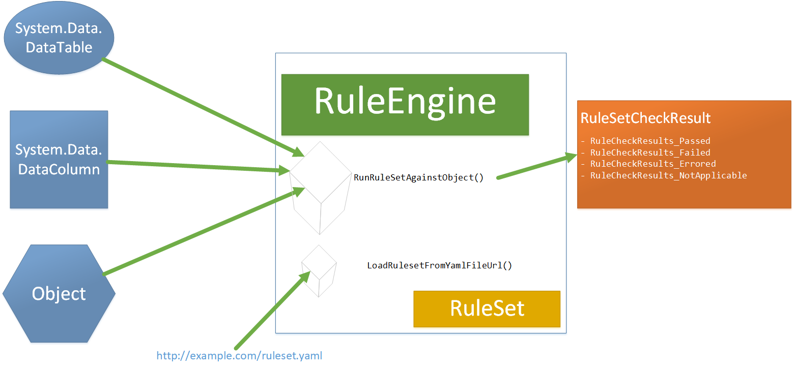

# Object Property Rule Engine and Compliance Checker

This .NET Standard 2.0 library is a rules engine that allows for evaluating property values of objects for compliance with a set of rules.

It was originally designed to run rules checks against various objects in the System.Data namespace. However, it can evaluate properties of any object. 

## Contributing

Please reference our [CONTRIBUTING.md](CONTRIBUTING.md) guide to learn about our development process, how to propose bugfixes and improvements.

## Feedback

If you want to provide feedback, report a bug or make a suggestion, you can either:

1. Add a bug/issue/ticket to our [BACKLOG.md](BACKLOG.md) and open a pull reuqest
1. Make the change yourself and open a pull request.

### Usage Example

```csharp
using System;
using System.Data;
using ObjectPropertyRuleEngine;

namespace NadsComplianceExample
{
    class Program
    {
        static void Main(string[] args)
        {
            string logicalName = "Hearing Office";
            string physicalName = "HOFC";

            RuleEngine e = new RuleEngine();
            e.LoadRulesetFromYamlFileUrl("/RuleSets/01-primary.YAML");

            DataTable dt = new DataTable();
            DataColumn col = dt.AddNewDataColumnWithExtendedProperties(logicalName, physicalName, "char(11)");

            RuleSetCheckResult ruleEngineResult = e.RunRuleSetAgainstObject(col);

            Console.WriteLine(ruleEngineResult.ResultText);

            Console.WriteLine();
            Console.WriteLine("Tests Passed");
            foreach (var item in ruleEngineResult.RuleCheckResults_Passed)
                Console.WriteLine($"{item.Rule.Description} \n\t {item.ResultText}");

            Console.WriteLine();
            Console.WriteLine("Tests Failed");
            foreach (var item in ruleEngineResult.RuleCheckResults_Failed)
                Console.WriteLine($"{item.Rule.Description} \n\t {item.ResultText}");

            Console.ReadLine();
        }
    }
}

```

#### Output

```console
HOFC Applicable:  3/47 | Passed: 1/3

Tests Passed
All attributes with a textual datatype must define the datatype length
         PASS: ([DatatypeLength][Is greater than][0])

Tests Failed
All attributes must be defined.
         Expected: ([Definition][IsNot][])
All logical names are expected to end with a class term, or a combination thereof, that semantically represents the data type of a data element.
         Expected: ([LogicalName][EndsWithAny][File;Line 4;Line 3;Line 2;Line 1;Line;Code;Address;Year;Timestamp;Time;Text;Switch;Rate;Percent;Number;Name;Indicator;Identifier;Description;Date;Count;Amount])
```

## Architecture



### Classes

#### RuleEngine

This is the main container. Has methods to load a `RuleSet` from a YAML string or URL. It's main method `RunRuleSetAgainstObject` is designed to accept objects from the `System.Data` namespace, however it really accepts an object of any type. The `RunRuleSetAgainstObject` method returns a `RuleSetCheckResult` object which contains results of evaluating the collection of `Rule` objects in the loaded `RuleSet`.

#### RuleSet

A `RuleSet` is a named collection of `Rule` objects.

#### Rule

A `Rule` is made up of an `Antecedent` and a `Consequent`. An `Antecedent` is the "if" part of a logical expression. A `Consequent` is the "then" part of a logical expresion. For example, given this expression:

***If a logical name ends with Name, then the datatype length should be greater than 10***

`Antecedent`: A logical name ends with Name
`Consequent`: The datatype length should be greater than 10

Both the Antecedent and Consequent properties are both `RuleExpressionGroup` object types.

#### RuleExpressionGroup

Represents 1 or many `RuleExpressions` and `RuleExpressionGroups` grouped together by a `LogicOperator` of either `And` or `Or`. A `RuleExpressionGroup` can be evaluated against a data structure object. This structure allows for implementing complex, nested `And`/`Or` logic. For example, you can solve the equivalent of the below with eq# representing different`RuleExpression` objects:

```basic
 ((((eq1 OR eq2) OR (eq3 AND eq4 AND eq5)) AND eq6 AND eq7 AND (eq8 OR eq9)) OR eq10)
```

[View the example on this unit test: `ComplexNestedRuleExpressionGroupTest()`](src\ObjectPropertyRuleEngine.Tests\Unit\RuleExpressionGroupTests.cs)

#### RuleExpression

Represents a single logical expression to be compared against a `System.Data` object's property. It has one public method `Evaluate()` which returns a boolean. A `RuleExpression` can be evaluated against a data structure object. A rule expression logically represents this structure:
`{PropertyName} {ComparisonCondition} {Value}`

- `"LogicalName" "EndsWith" "Timestamp"`
- `"ColumnName.Length" "IsLessThan" 18`
- `"" "Is" "Joseph"` **if the property is empty, the object itself will be evaluated (use case: primitive datatypes)*

#### RuleSetCheckResult

This class conatains a four collections of `RuleCheckResult` objects as properties. These are populated when a `RuleSet` is evaluated against an object.:

1. `RuleCheckResults_Passed`
1. `RuleCheckResults_Failed`
1. `RuleCheckResults_NotApplicable`
1. `RuleCheckResults_Errored`

#### RuleCheckResult

This class represents the results of evaluating one `Rule` against one object. It tells if the `Rule` applies to the object passed by evaluating the `Rule.Antecedent` and populating the `AntecedentEvaluatesToTrue` property. If the `AntecedentEvaluatesToTrue` is *true*, then `Rule.Consequent` is evaluated and the `ConsequentEvaluatesToTrue` will be populated. If the `AntecedentEvaluatesToTrue` is *false* , then the `ConsequentEvaluatesToTrue` will be left *null*.
